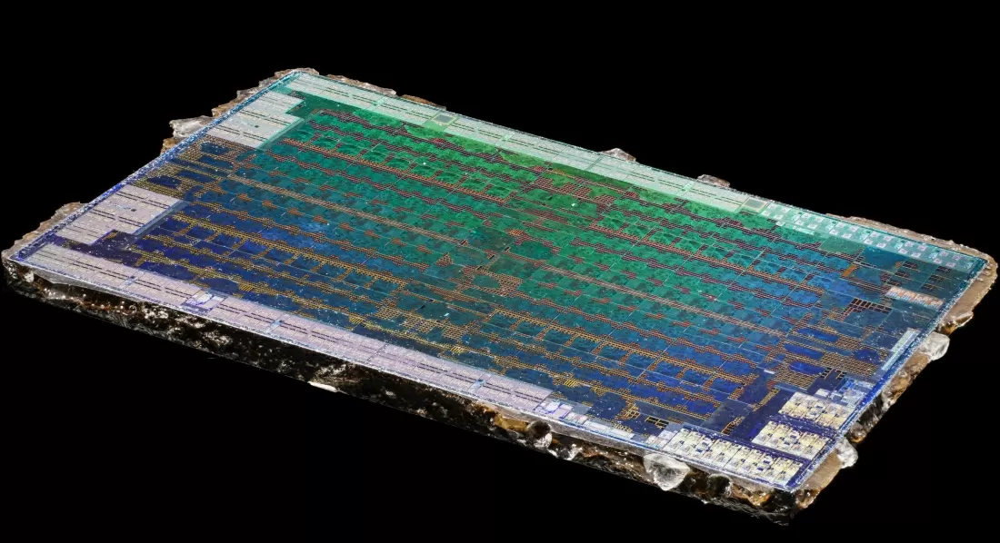

## The problem

Chip vendors used to publish die shots as part of technical marketing;
increasingly they've replaced that with slide-deck diagrams that carry far
less information for anyone trying to actually understand the silicon.
Nothing filled the gap for recent, consumer-grade hardware — CPUs and GPUs
people actually own, not historical museum pieces.

## What they did

Fritzchens Fritz delids hardware — desktop CPUs, GPUs, memory chips — by
removing the integrated heat spreader, then macro-photographs the exposed
die. The published album runs to hundreds of images spanning old and recent
hardware, up to and including current-generation GPU dies at the time of
shooting. Each shot is close, sharp, and presented largely without added
graphics — the die's own structure, colour, and layer pattern is the whole
image.

## What we take

This is the most direct model for plain macro photography of exposed
silicon: no annotation layer, no dramatic lighting, the physical object
photographed as itself. Useful specifically as the "boards and chips, shot
plainly" reference to set against the more staged, magazine-style hardware
photography we're trying to avoid. Worth pairing in the wall text with
Zeptobars and IRIS as three points on the same axis — destructive and
simple, destructive and archival, non-destructive and technical.

What doesn't transfer: like Zeptobars, this method destroys the object to
photograph it, which rules it out for anything we can't replace.

Source: <https://www.techspot.com/news/65927-awesome-homemade-chip-delidding-images.html>
